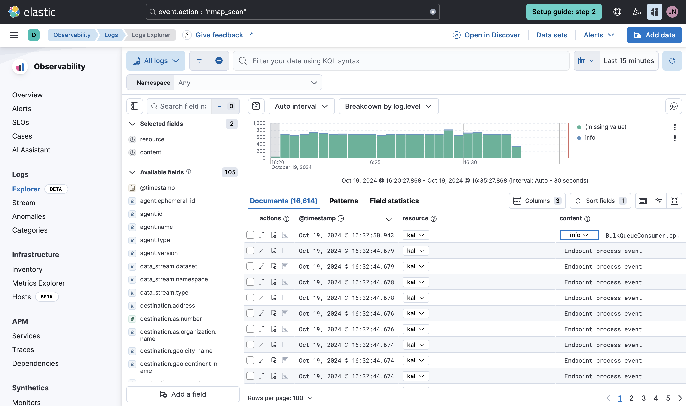
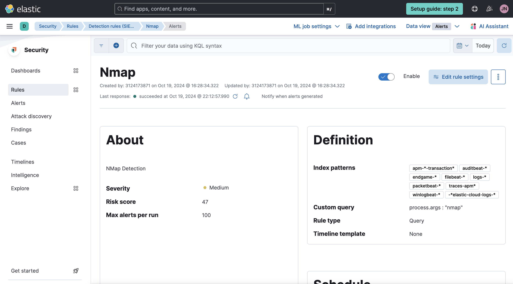

# Elastic SIEM Tools

## Record Logs with SIEM Tools

 <i>Log that has been recorded by SIEM Tools</i> 

## Create and configure rule and alerts

 <i>Alert and Rules detected Nmap scan in the network</i> 
